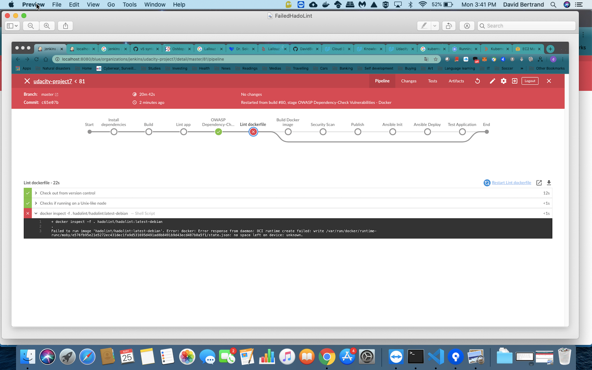

# ***Set Up Pipeline***
## 1. Create Github repository with project code.
Github [repository](https://github.com/DavidBertrand/udacity-project7)

## 2. Use image repository to store Docker images
DockerHub [repository](https://hub.docker.com/r/bertrand282/project7)

# ***Build Docker Container***

## 1. Execute linting steps in pipelime

### Failed Pylint:

### Failed Hadolint:

## 2. Build a Docker container in a pipeline

# ***Successful Deployment***

## 1. The Docker container is deployed to a Kubernetes cluster

## 2.Use Blue/Green Deployment or a Rolling Deployment successfully

# ***Suggestions to Make Your Project Stand Out!***
1. Perform additional CI steps in the pipeline outside of just linting.

2. Perform security scanning of the Docker containers

3. Post-deployment add testing of your application

    a. Pipeline Test Application is running 

    b. Post Deploymnt OWASP ZAP Security Scan

    c. Post Deploymnt OWASP ZAP Security Report
